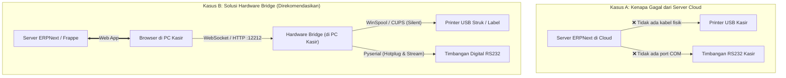

# 🏛️ Analisis Arsitektur: ERPNext Server vs Client PC Bridge

Pertanyaan Utama:  
**"Apakah direct print & pembacaan serial port bisa dilakukan langsung dari sisi ERPNext (server), atau hanya bisa di Client PC?"**

---

## 📌 Ringkasan Jawaban Cepat

| Jenis Perangkat | Direct dari Server ERPNext? | Melalui Client PC Bridge? | Rekomendasi & Standar Industri |
| :--- | :---: | :---: | :--- |
| **Printer Thermal USB** (Epson TM-T82, Xprinter, dsb) | ❌ **TIDAK BISA** | ✅ **BISA (Sangat Cepat)** | **Client PC Bridge** (Wajib) |
| **Printer Label Barcode USB** (Godex G500, Zebra ZPL) | ❌ **TIDAK BISA** | ✅ **BISA** | **Client PC Bridge** (Wajib) |
| **Timbangan Digital RS232 / USB** (Mettler, ViBRA, A&D) | ❌ **TIDAK BISA** | ✅ **BISA (Real-time)** | **Client PC Bridge** (Wajib) |
| **Printer Jaringan (LAN / Wi-Fi)** port 9100 JetDirect | ⚠️ **BISA** *(Syarat Khusus)* | ✅ **BISA** | **Bisa keduanya** (tergantung topologi jaringan) |

---

## 🔍 Penjelasan Teknis Mendalam

### 1. Mengapa Printer & Timbangan USB TIDAK BISA dari Sisi Server ERPNext?

1. **Jarak Fisik & Ketiadaan Bus Hardware:**
   - Server ERPNext umumnya berada di **Cloud VPS** (misal AWS, DigitalOcean, Hetzner), di dalam **Docker Container**, atau di **WSL / Virtual Machine**.
   - Kabel USB printer kasir dan kabel RS232 timbangan dicolokkan ke **port fisik laptop/PC kasir di toko/gudang**.
   - Server di cloud tidak memiliki kabel atau koneksi hardware bus fisik ke motherboard PC kasir.

2. **Batasan Keamanan Peramban (Browser Sandbox):**
   - Kasir membuka ERPNext melalui peramban (Chrome, Edge, Firefox).
   - Aturan keamanan web modern melarang website publik secara bebas mengakses port serial perangkat keras lokal (`COM1`, `/dev/ttyUSB0`) atau mengirim byte mentah ke printer tanpa interaksi pengguna.
   - Perintah standar `window.print()` di browser selalu memunculkan pop-up jendela dialog cetak (`Ctrl+P`), sehingga kasir harus menekan tombol "Print" lagi setiap kali transaksi (bukan *silent print*).

3. **Multi-Cabang & Multi-Kasir (Routing Kasir):**
   - Jika ada 5 kasir di 5 toko berbeda yang mengakses server ERPNext yang sama: jika server mencoba mencetak, bagaimana server tahu kasir mana yang sedang menekan tombol cetak jika tidak ada bridge di PC masing-masing?

---

### 2. Kapan Server ERPNext BISA Mencetak Langsung Tanpa Bridge?

Server ERPNext **HANYA BISA** mencetak langsung jika:
1. Printer adalah **Network Printer (Ethernet LAN atau Wi-Fi)** yang memiliki alamat IP statis (misal `192.168.1.150`).
2. Server ERPNext berada di **Local Area Network (LAN) yang sama** dengan printer (misal server on-premise lokal), ATAU terhubung melalui **VPN Site-to-Site / WireGuard / ZeroTier**.
3. Printer mendukung protokol **RAW Port 9100 (JetDirect)** atau **IPP / LPD**.

Dalam skenario ini, kode Python di server ERPNext dapat membuka TCP socket:
```python
import socket
with socket.create_connection(('192.168.1.150', 9100), timeout=5) as s:
    s.sendall(b"\x1b@Struk dari ERPNext Server...\x1dV\x00")
```
> **Catatan:** Sekalipun skenario ini dimungkinkan untuk printer jaringan, **timbangan digital RS232 kabel tetap TIDAK BISA dibaca oleh server** kecuali timbangan tersebut dihubungkan ke Serial-to-Ethernet Device Server (seperti Moxa NPort).

---

### 3. Diagram Alur Perbandingan Arsitektur



---

## 🎯 Kesimpulan & Keunggulan Menggunakan WebApp Hardware Bridge

Dengan menjalankan **WebApp Hardware Bridge** di PC Client (Windows 10/11 atau Linux Mint 22 / Ubuntu 22):

1. **Silent Print Sejati (0 Klik Tambahan):**
   Saat kasir menekan tombol "Bayar" atau "Submit" di ERPNext, struk langsung keluar dari printer detik itu juga tanpa dialog `Ctrl+P`.
2. **Pembacaan Timbangan Real-Time:**
   Browser ERPNext dapat menampilkan display timbangan digital yang terus bergerak secara live dan mengunci angka saat timbangan stabil.
3. **Bebas Masalah Bentrok Port (Cooperative Locking):**
   Jika ada aplikasi desktop lain (misalnya program lama berbasis Delphi) yang juga membutuhkan port COM timbangan, bridge memiliki mode **On-Demand** dan fitur **Lepas Port (Yield/Pause)** sehingga tidak ada error `PermissionError / Access Denied`.
4. **Portabel & Mandiri:**
   Server ERPNext tetap bersih, aman di cloud, dan tidak dibebani driver printer berbagai merk.
